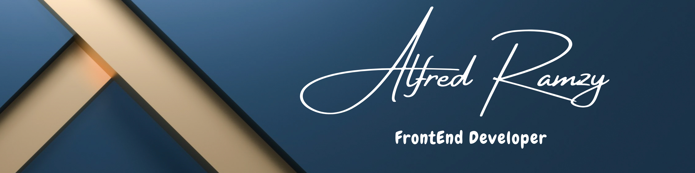

<h1 align="center">
    
</h1>

 

<h3 align="center">A passionate FrontEnd developer from Egypt </h3>

 

<ul align="left">
    <li>🔭 I’m currently a <strong>Front-End Developer</strong>.</li>
    <li>🎓 Computer Science student at <strong><a href="https://www.acu.edu.eg/">Ahram Canadian University</a></strong>.</li>
    <li>💬 Ask me about my experience with JavaScript, TypeScript, Angular+2, or anything related to web development.</li>
    <li>📫 How to reach me: <strong><a href="https://www.linkedin.com/in/alfredramzy/">Alfred Ramzy</a></strong>.</li>
</ul>

 

 
  
  

 

 
<h2 align="center">⚒️ Languages-Frameworks-Tools ⚒️</h2>
 

    
     

 

  <h2>🐍 My Contributions 🐍</h2>
   
  
  
     

<h2 align="center">⚡ Stats ⚡</h2>
 

  

  

 

 
